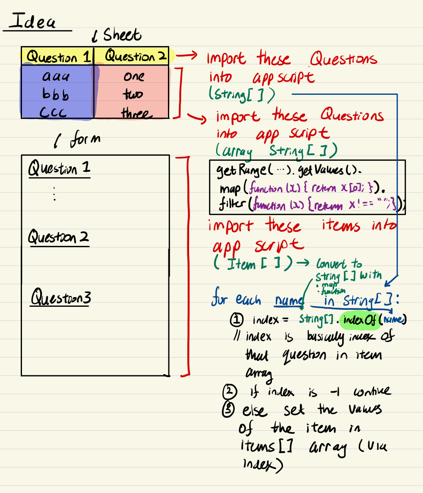

## Table of contents
1. [Structure of a google sheets](#1)
2. [Printing](#2)
3. [getRange() function](#3)
4. [setValue(obj) and getValue()](#4)
5. [Variables](#5)
6. [Clear the log](#6)
7. [for loops](#7)
8. [Accessing different sheets](#8)
9. [Clearing a sheet](#9)
10. [Creating custom functions](#10)
11. [if, else if, else](#11)
12. [Javascript arrays](#12)
13. [Copying and pasting with getValues() and setValues()](#13)
14. [Applying a formula and copying it down](#14)
15. [Script to automate google form categories](#15)
16. [onEdit Trigger](#16)

## Structure of a google sheets <a name="1"></a>
The structure of google sheets is: 

1. Application [SpreadsheetApp is an object]

2. Spreadsheet [SpreadsheetApp.getActiveSpreadsheet()]

3. Sheets [SpreadsheetApp.getActiveSpreadsheet().getActiveSheet()]

4. Range or cells [SpreadsheetApp.getActiveSpreadsheet().getActiveSheet().getRange("D2").setValue(99)]

## Printing<a name="2"></a>
Logger.log("Hello world") : prints out hello world to the log

## getRange() function<a name="3"></a>
- getRange("D2") : references individual cell
- getRange("D2:F8") : References a range of cells
- getRange(2, 4): Also references "D2"
- getRange(2, 4, 18): References "D2" and then 18 rows below it
- getRange(2, 4, 18, 5): References "D2" and then 18 rows below it and 5 columns beside it. 

## setValue(obj) and getValue()<a name="4"></a>
After obtaining a range of cells values we can use the 
- setValue("hello") or setValue(5) : to set values
- getValue() : To get the values at a range of cells and then store them in some temporary variable. 

A typical workflow could be: var a = range.getValue() $\implies$otherRange.setValue(a)
## variables <a name="5"></a>
Variables are made with the ```var``` keyword. For example: 
	
	// Our application
	var myApp = SpreadsheetApp;
	// get the active sheet from our active spreadsheet
	var activeSheet = myApp.getActiveSpreadsheet().getActiveSheet();
	// from the active sheet, get the (8, 1) cell and obtain it's value
	var temp = activeSheet.getRange(8, 1).getValue();
	// print the value to the log
	Logger.log(temp);
	// set the value in the cell. 
	activeSheet.getRange(8, 1).setValue(temp + 5);
## Clear the Log <a name="6"></a>
To clear the log we use the ```Logger``` object and the ```clear()``` method. So ```Logger.clear()```
## For loops <a name="7"></a>
For ```for``` loops we remember to just use the ```var``` keyword instead of something like ```int```. 

	// we increment the cell (4, 1) vertically down until cell (13, 4)
	var startRow = 1;
	var endRow = 13;
	var col = 1;

	// The active sheet
	var myActiveSheet = SpreadsheetApp.getActiveSpreadsheet().getActiveSheet();

	for (var i = startRow; i <= endRow; i++) {
		var temp = myActiveSheet.getRange(i, col).getValue();
		temp++;
		myActiveSheet.getRange(i, col).setValue(temp);
	}
## Accessing different sheets <a name="8"></a>
To access different sheets, different to the current active sheet (i.e ```SpreadsheetApp.getActiveSpreadsheet().getActiveSheet()```) we need to use the ```getSheetByName("[sheet name]")``` method on our current active Spreadsheet. 

	Logger.clear();
	// Get the current active spreadsheet
	var currSpreadsheet = SpreadsheetApp.getActiveSpreadsheet();

	// Set a value in sheet 2 and get the value to store it in 'temp'
	var sheet2 = currSpreadsheet.getSheetByName("Sheet2");
	sheet2.getRange(1, 1).setValue("hello");
	var temp = sheet2.getRange(1,1).getValue();

	// set the value in sheet 3
	var sheet3 = currSpreadsheet.getSheetByName("Sheet3");
	sheet3.getRange(1,1).setValue(temp);

## Clearing a sheet <a name="9"</a>
To clear a range (eg: "A1:F11") from a sheet (eg: a named sheet or the active sheet) we use one of three commands:
- ```clearFormat()``` : clears the formatting in the rectangle of cells
- ```clearContent()```: clears the contents in the rectangle of cells
- ```clear()``` : clears all data and formatting

		function() clearTheMess() {
			var activeSheet = SpreadsheetApp.getActiveSpreadsheet().getActiveSheet();
			activeSheet.getRange("A1:F11").clear();
		}

## Creating custom functions <a name="10"></a>
To create custom functions (which also **show up** with documentation: need to add /** ...*/ comment) we just remember to specify the **arguments** and to **return** a result. 

	/**
	* This function multiplies 2 numbers
	*
	* @param arg1 is the first number in our multiplcation
	* @param arg2 is the second number in our multiplication
	* @customfunction
	*/

	function multiplyTwoNumbers(arg1, arg2) {
		var result = arg1 * arg2;
		return result;
	}

## if, else if, else <a name="11"></a>
Example: if we had a sheet with one column being the marks of students and we wanted to see whether they got: 
- Pass: P
- Credit: C 
- Distinction: D 
- High Distinction: HD

The following example code shows how this would be implemented.

	// This function looks at the grade of a student and tells us whether they got: 
	// HD, D, CR, P or F
	function grade() {

	  var sheetTwo = SpreadsheetApp.getActiveSpreadsheet().getSheetByName("Sheet2");
	  var startRow = 1;
	  var endRow = 60;
	  var col = 1;
	  for (var i = startRow; i <= endRow; i++) {
		var num = sheetTwo.getRange(i, col).getValue();
		if (num >= 85) {
		  sheetTwo.getRange(i, col + 1).setValue("HD");
		} else if (num >= 75) {
		  sheetTwo.getRange(i, col + 1).setValue("D");
		} else if (num >= 65) {
		  sheetTwo.getRange(i, col + 1).setValue("CR");
		} else if (num >= 50) {
		  sheetTwo.getRange(i, col + 1).setValue("P");
		} else {
		  sheetTwo.getRange(i, col + 1).setValue("F");
		}
	  }
	  
	}

## Javascript arrays <a name="12"></a>
- while ```getValue()``` is useful for obtaining a single value, ```getValues()``` returns a javascript array for us
- The following example gives us the following array of arrays in the log ```[[1.0, two, 3.0], [four, 5.0, six]]``` (assuming the data is there in sheet 3). 

	
		function seeArray() {
		  var sheetThree = SpreadsheetApp.getActiveSpreadsheet().getSheetByName("Sheet3");
		  var myArray = sheetThree.getRange("A1:C2").getValues();
		  Logger.log(myArray);
		}

- To make a javascript array (in this case we do an array of arrays) and to write the array instead of the previous ```setValue()``` method which works more for one value, we use the ```setValues()``` method. Note the added extra "s". 
	
		var mySecondArray = [[1, "two", 3], ["four", 5, "six"]];
		SpreadsheetApp.getActiveSpreadsheet().getSheetByName("Sheet3").getRange("E1:G2").setValues(mySecondArray);

## copying and pasting with getValues() and setValues() <a name="13"></a>

	function copyAndPaste() {
	  var sheetThree = SpreadsheetApp.getActiveSpreadsheet().getSheetByName("Sheet3");
	  var myArray = sheetThree.getRange("A1:C2").getValues();
	  sheetThree.getRange(4, 1, 2, 3).setValues(myArray);
	}

## Applying a formula and copying it down <a name="14"></a>

- ```setFormula("[string]")``` : method after you have cell range
- ```getLastRow()``` : returns a number which is the last row we have. Method on the sheet
- ```copyTo("range")``` : a range
- ```copyTo("range", {contentsOnly: true})``` : copies only by value

First example

	function myFunction() {
		var ss = SpreadsheetApp.getActiveSpreadsheet().getActiveSheet();
		ss.getRange("D2").setFormula("=(A2 + B2) * C2");

		var lastRow = ss.getLastRow();
		var fillDownRange = ss.getRange(2, 4, lastRow - 1);
		ss.getRange("D2").copyTo(fillDownRange);
	}

Another Example 

	function myFunction() {
	  var ss = SpreadsheetApp.getActiveSpreadsheet().getActiveSheet();
	  /**********************************************************************************************************************
	  * THIS SECTION IS SET UP FOR THE DATA, WE COULD HAVE JUST AS EASILY MADE UP RANDOM VALUES IN TWO COLUMNS FROM 0 TO 100*/
	  // Initialise (1, 1), (1, 2), (1, 3)
	  ss.getRange(1, 1).setValue("Num 1");
	  ss.getRange(1, 2).setValue("Num 2");
	  ss.getRange(1, 3).setValue("Num 3");
	  var numHeaderRows = 1;
	  
	  // Initialise the cell (2, 1) to have the formula "=RANDBETWEEN(0, 100)"
	  ss.getRange(2, 1).setFormula("=RANDBETWEEN(0, 100)");
	  
	  // copy it down by 8 and across by 3
	  ss.getRange(2, 1).copyTo(ss.getRange(2, 1, 8, 3));
	  
	  // We only want the values...Hence we have to copy only by value now
	  // We have a variable for the last row in our data
	  // get range from (2,1) down by (lastRowNum - numHeaderRows) and across by 3 [could've also just said "down by 8" but we demonstrate the use
	  // of the getLastRow() function]
	  // copy the contents to (2,4) down by (lastRowNum - numHeaderRows) and across by 3
	  var lastRowNum = ss.getLastRow();
	  ss.getRange(2, 1, lastRowNum - numHeaderRows, 3).copyTo(ss.getRange(2, 4, lastRowNum - numHeaderRows, 3), {contentsOnly: true});
	  
	  // We now copy back from (2, 4) [down 8, right 3] to (2, 1) [down 8, right 3] by value
	  ss.getRange(2, 4, lastRowNum - numHeaderRows, 3).copyTo(ss.getRange(2, 1, lastRowNum - numHeaderRows, 3), {contentsOnly: true});
	  
	  // clear the data from our temporary space
	  ss.getRange(2, 4, lastRowNum - numHeaderRows, 3).clear();
	  /***********************************************************************************/
	  /* THIS NEXT SECTION DEALS WITH THE ACTUAL COPYING OF OUR DATA */
	  ss.getRange("D2").setFormula("=(A2 + B2) * C2");
	  var fillDownRange = ss.getRange(2, 4, lastRowNum - numHeaderRows);
	  ss.getRange("D2").copyTo(fillDownRange);
	}

## Script to automate google form categories <a name="15"></a>
We set global variables: **Spreadsheet ID**, the **form ID**. You will need to change the ID as necessary

1. Find the spreadsheet ID and the form ID from the urls and store them into variables

2. using ``SpreadsheetApp`` class we use the ``openByID()`` method to open the spreadsheet, then use the ```getSheetByName()``` method to open the spreadsheet by name
3. Similarly we use the ```FormApp``` class and the method ```openByID()``` to open the form by the ID. 
4. **Testing code so far**... From our ```form``` object, we can use the ```getItems()``` method which returns an ```Item[]``` and then use the ```getId()``` method (on say ```Item[0]```) to find the Id. 

5. **Testing code so far**...With our ```form``` object we can use the ```getItemById()``` method and input the Id number which we just found. From this ```Item``` we can do various things to it like ```getTitle()```, ```getType()``` and even cast it ```asListItem()``` or ```asMultiplechoiceItem()```. Once you've case it as a ```ListItem``` or a ```MultipleChoiceItem``` we then want to use the ```setChoiceValues()``` method to set the options via a string array. 



## onEdit Trigger <a name="16"></a>
